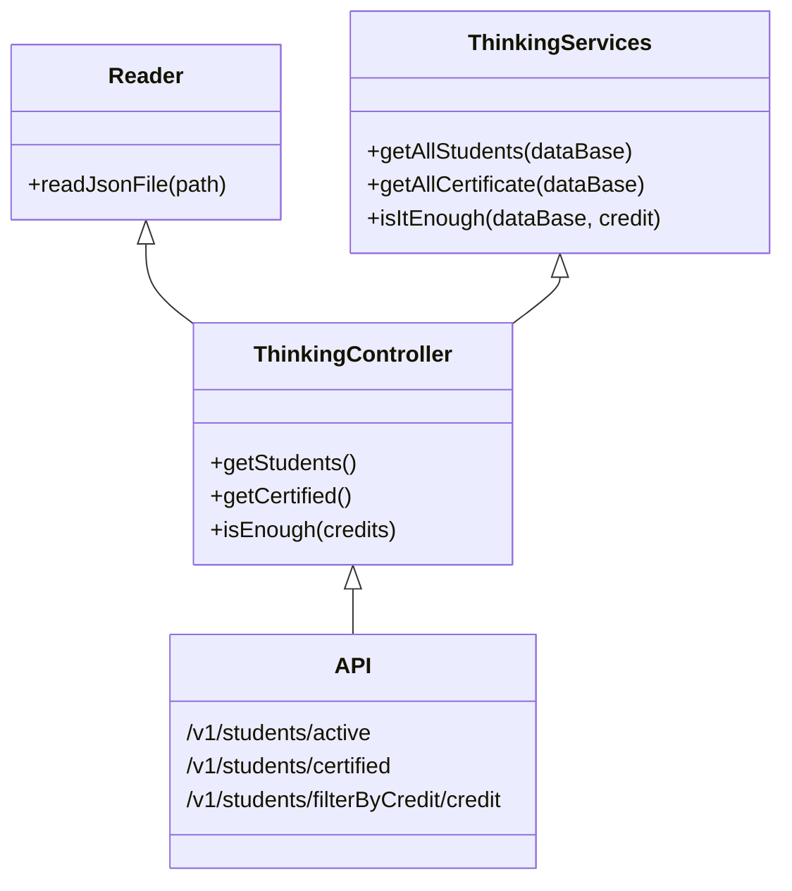
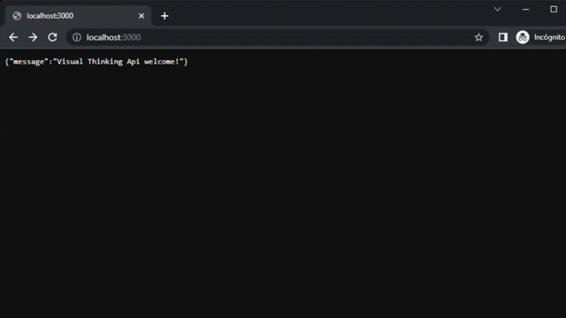

# CodeChallenge
> Started at 12:20 on 04/28 - pauses 14:30 on 04/28
> Resume at 20:48 on 04/28 - end of code at 23:58
> Total coding time: 5 hours and 20 minutes.

Este code challenge es parte de la formación con LaunchX en Backend con Node JS

## Objetivos al finalizar el proyecto:
- Repo en GitHub para el proyecto
- Pruebas automatizadas en GitHub Actions
- README.md

## Componentes del proyecto
###  Repo de GitHub
Este proyecto deberá:
- Consultar todos los estudiantes con todos sus campos.
- Consultar los emails de todos los estudiantes que tengan certificación haveCertification.
- Consultar todos los estudiantes que tengan credits mayor a 500.

`` La estructura del objeto estudiante es la siguiente (se tiene un archivo json con una lista de estos objetos): ``
```json
{
  "id": "6264d5d89f1df827eb84bb23",
  "name": "Warren",
  "email": "Todd@visualpartnership.xyz",
  "credits": 508,
  "enrollments": [
    "Visual Thinking Intermedio",
    "Visual Thinking Avanzado"
  ],
  "previousCourses": 1,
  "haveCertification": true
  }
```

- Tener un endpoint por consulta para ejecutarse.

### Flujo de trabajo
Se toma en cuenta los siguientes requerimientos:
- Se lleva un control de versiones claro y explicito en su avance.
- Se realizan pruebas para asegurar la calidad del proyecto.
- Las pruebas se ejecutan de manera automática en el repo.

## Readme
### Dependencias utilizadas en el proyecto y su propósito:
- **Jest**: Ejecutar pruebas unitarias y verificar el correcto funcionamiento del código.

 Como apunte, se debe modificar la versión de Jest ya que hay un error al trabajar con GitHub actions, esto se realiza ejecutando el siguiente comando:
 >npm install jest@26.0.0 --save

 >GitHub Actions: El archivo test.yml dentro del directorio ``/.github/workflows/`` automatiza las pruebas que implementamos de manera local con Jest para verificar que funcionen como se espera. Esta implementación requiere de 
 una modificación a la versión de Jest, véase el punto anterior.

 - **ESLint**: Mantener limpieza en el código, que este sea legible, claro y conciso en su escritura.

 - **Express**: Para levantar el servidor

### Componenetes:

- **Reader**: Dentro de el directorio ``/lib/utils/``, su función es la de leer el archivo Json que se utiliza como Data Base. Este archivo tiene su respectiva prueba dentro del directorio ``/test/utils/Reader.test.js``

```javascript
    static readJsonFile(path) {
        const rawdata = fs.readFileSync(path);
        return JSON.parse(rawdata);
    }
```

- **ThinkingServices**: Ubicado en el directorio ``/lib/services/``, se encarga de implementar la lógica requerida para manejar la información. Las pruebas se realizan en el archivo ``/test/services/ThinkingServices.test.js``

```javascript
    static getAllStudents(dataBase) {
        const allStudents = dataBase;
        return allStudents;
    }
    static getAllCertificate(dataBase) {
        const certifiedStudents = dataBase.filter((thinker) => thinker.haveCertification === true);
        return certifiedStudents.map((thinker) => thinker.email)
    }
    static isItEnough(dataBase, credit) {
        const enoughCredits = dataBase.filter((itsEnough) => itsEnough.credits > credit);
        return enoughCredits
    }
```

- **ThinkingController**: Ubicado en el directorio ``/lib/controllers/`` es el puerto de enlace entre las funciones del código en ``ThinkingServices.js`` y la base de datos que utilizamos, que en este caso es ``visualpartners.json``
Las pruebas para este archivo se realizan en ``/test/controllers/ThinkingController.test.js``

```javascript
static getStudents() {
        const thinkers = Reader.readJsonFile("visualpartners.json");
        const students = ThinkingServices.getAllStudents(thinkers);
        return students;
    }
    static getCertified() {
        const thinkers = Reader.readJsonFile("visualpartners.json");
        const certificate = ThinkingServices.getAllCertificate(thinkers);
        return certificate;
    }
    static isEnough(credits) {
        const thinkers = Reader.readJsonFile("visualpartners.json");
        const overIt = ThinkingServices.isItEnough(thinkers, credits);
        return overIt;
    }
```





### API
**Configuración de la API**
- La API se construye con Express JS
- La API se despliega en el puerto 3000
- Para manejar la información se toman controles del Controlador ``ThinkingController.js``
La configuración de la API es la siguiente: 

```javascript
const ThinkingController = require("./controllers/ThinkingController");
const express = require("express");
const app = express();
app.use(express.json());
const port = 3000;
```

El primer método que utiliza la API es el de getStudents, el cual entrega una lista de los estudiantes en la base de datos con todos sus campos.
```javascript
app.get("/v1/students/active", (request, response) => {
    const students = ThinkingController.getStudents();
    response.json(students);
});
```
El endpoint regresa la lista de manera automática sin necesidad de ingresar ningún parametro:
<figure>

</figure>

El segundo método que utiliza es ``getCertified()``, el enpoint consulta el valor del campo ``haveCertification`` y verifica que contenga ``true``, regresa una lista de los correos de los estudiantes que cumplan esta condición.
```javascript
app.get("/v1/students/certified", (request, response) => {
    const certificate = ThinkingController.getCertified();
    response.json({haveCertification: true, email: certificate});
});
```
Este endpoint tampoco necesita recibir ningún parámetro ya que la verificación se realiza desde ``ThinkingServices.js``
<figure>

</figure>

Finalmente la API consulta ``isEnough(credits)`` el cual requiere de ingresar un valor en la url para tomar como parámetro y devolver los estudiantes que contienen un valor mayor al que se pasa en el campo **credits** .
```javascript
app.get("/v1/students/filterByCredit/:credit", (request, response) => {
    const credits = request.params.credit;
    const enough = ThinkingController.isEnough(credits);
    response.json({creditsOver: credits, students: enough});
});
```
<figure>

</figure>


